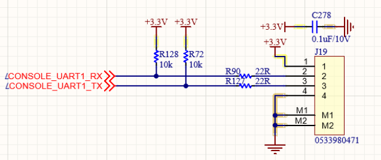
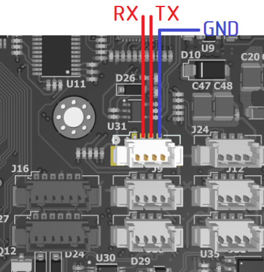
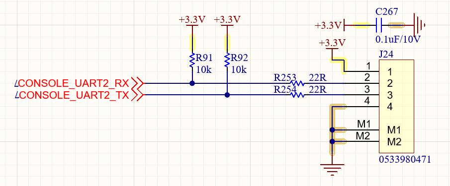
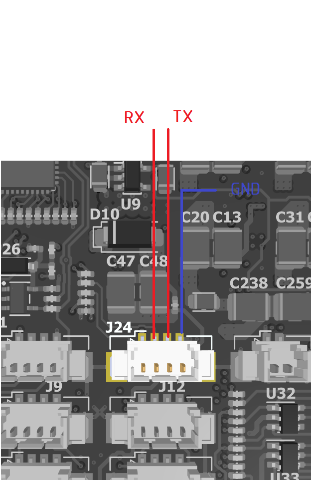

# EXP-Satellite Kernel

## Build Image

### Setup Yocto environment

* WorkDir:
```
mkdir compulab-nxp-bsp && cd compulab-nxp-bsp
```
* Set a CompuLab machine:

```
export MACHINE=ucm-imx93
```

### Initialize repo manifests

* NXP
```
repo init -u https://github.com/nxp-imx/imx-manifest.git -b imx-linux-mickledore -m imx-6.1.55-2.2.0.xml
```

* CompuLab
```
mkdir -p .repo/local_manifests
wget --directory-prefix .repo/local_manifests https://raw.githubusercontent.com/compulab-yokneam/meta-bsp-imx9/mickledore-6.1.55-2.0/scripts/meta-bsp-imx9.xml
repo sync
```
### Setup build environment

* Initialize the build environment:
```
source compulab-setup-env -b build-${MACHINE}
```

### Add custom meta, make change `bb.conf`, `local.conf`

###  Building full rootfs image:

* Build command 
```
bitbake core-image-satellite
```

### Deploy Image:
* Recommend to use `Rufus 4.9p`:
* Flash this image:
```
build-ucm-imx93/tmp/deploy/images/ucm-imx93/core-image-satellite-ucm-imx93-.rootfs.wic.zst
```
### User Access:
```
   $> usr: root / pwd: 1234
   $> usr: bee / pwd: SLt@2025
```

## DFT
### RNDIS USB Ethernet:
* **`bee`**
``` 
sudo ifconfig usb0 192.168.6.7 netmask 255.255.255.0 up 
```
### Console:
* UART1 (A55):

<p align="center">
  
  
</p>

* UART2 (M33):

<p align="center">
  
  
</p>

## Folder-tree
### Structure Overview
``` bash
conf/
docs/
meta-editsource/
meta-satellite/
source_dev/
```

- conf/

General configuration files for the Yocto environment.

- docs/

Project documentation, images, development notes, and references.

### Yocto Layers

The project uses two main custom Yocto layers:

- `meta-editsource`

- `meta-satellite`

These layers extend and customize the base BSP (Board Support Package) from CompuLab and NXP.

 **`meta-editsource/`**

This layer contains kernel modifications and BSP-level patches required for the current board and project.

It includes:

- Kernel patches (under` recipes-kernel/linux/files`)
Used to adjust device tree, drivers, pin configurations, or kernel features.

- U-Boot patches (under `recipes-bsp/u-boot/files`)
Necessary for bootloader customization, boot flow, secure boot, or hardware init.


 **`meta-satellite/`**

This is the main application layer of the project and contains most of the core system tools, satellite functions, and runtime scripts.

It includes:

1. `recipes-apps/`


2. `recipes-connectivity/`

- Network & connectivity components:

    + ModemManager, ofono 
    + OpenSSH for remote access
    + pregen_sshkey for provisioning pre-generated secure keys

3. `recipes-core/`

   Core system modifications:

- `base-files`: filesystem overlays

- `custom-files/files`: large collection of scripts and utilities

- `firstboot, grow-fs`: boot-time automations, create partitions filesystem

- `startup-scripts, systemd, service-systemd`: systemd unit files

- `udev-perms`: device permission rules

- `usb-gadget-config`: RNDIS configuration and USB gadget setup

- `images/`: custom image definition (e.g. core-image-satellite.bb)

The folder `custom-files/files/` contains runtime utilities such as:
 - image capture and compression scripts (capture.py, jpg_compress.py)

 - I2C and GPIO test tools (e.g., pca9540.py, test_i2c.py)

 - RPMsg communication scripts (rpmsg.py, rpmsg_daemon.py)

 - File monitoring services (file_watcher.py, file_daemon.py)

 - Camera control tools (switch_lane.py, switch_sensor.py)

- Prebuilt firmware images (freertos_hello.elf, payexp_m33.elf)

- Various automation scripts (setup.sh, run_m33.sh, supervisor.sh)


4. `recipes-kernel/`

Kernel integration, typically overlays the kernel from meta-editsource and adds Compulab-specific settings.

**```source_dev/```**

The main component is:

`libcsp/`


Inside  `00_Dev16/DevSrc/exp_server/` , you have:

Experiment server source (`src/`)

CSP-based communication deploy source (`lib/exp_csp, exp_handler, exp_table, …`)

Tools for simulating OBC ↔ EXP communication when testing on PC

This folder is primarily used for pre-integration development and to support ground testing or simulation before zipping and pushing code into Yocto recipes.